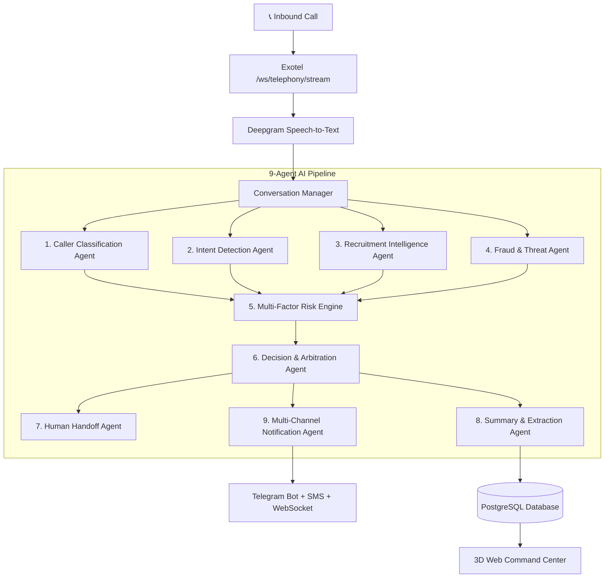

# CallGuard AI — Autonomous Cognitive Call Screening & Threat Intelligence

```
  ██████╗ █████╗ ██╗     ██╗      ██████╗ ██╗   ██╗ █████╗ ██████╗ ██████╗      █████╗ ██╗
 ██╔════╝██╔══██╗██║     ██║     ██╔════╝ ██║   ██║██╔══██╗██╔══██╗██╔══██╗    ██╔══██╗██║
 ██║     ███████║██║     ██║     ██║  ███╗██║   ██║███████║██████╔╝██║  ██║    ███████║██║
 ██║     ██╔══██║██║     ██║     ██║   ██║██║   ██║██╔══██║██╔══██╗██║  ██║    ██╔══██║██║
 ╚██████╗██║  ██║███████╗███████╗╚██████╔╝╚██████╔╝██║  ██║██║  ██║██████╔╝    ██║  ██║██║
  ╚═════╝╚═╝  ╚═╝╚══════╝╚══════╝ ╚═════╝  ╚═════╝ ╚═╝  ╚═╝╚═╝  ╚═╝╚═════╝     ╚═╝  ╚═╝╚═╝
```

> **Zero-trust inbound telephony defense platform powered by 9 specialized cognitive AI agents, hybrid ML classification, real-time audio streaming, and an immersive 3D command center.**

[](https://callguard-dashboard.onrender.com)
[](https://call-gaurd-ai.onrender.com/docs)
[](https://python.org)
[-black?style=for-the-badge&logo=next.js)](https://nextjs.org)
[](LICENSE)

---

## 🌐 Live Production Deployments

| Component | URL / Endpoint | Description |
| :--- | :--- | :--- |
| 🛡️ **3D Web Command Center** | [callguard-dashboard.onrender.com](https://callguard-dashboard.onrender.com) | Interactive 3D Cyber Defense dashboard with live telemetry. |
| ⚙️ **Backend API & Swagger** | [call-gaurd-ai.onrender.com/docs](https://call-gaurd-ai.onrender.com/docs) | FastAPI asynchronous REST & WebSocket backend. |
| 📞 **Live Telephony Number** | `+91 04045902896` | Exotel Virtual Numbers configured with CallGuard AI. |
| 🤖 **Telegram Alert Bot** | `@callguard_ganesh_bot` | Real-time push notifications for screened calls. |

---


---

## 🎯 The Core Problem & Philosophy

India experiences **over 1.5 billion spam and scam calls monthly**, spanning job recruitment extortion, banking OTP phishing, emergency impersonation, and automated robocalls.

### Why Existing Solutions Fail
* **Number Blacklists (Truecaller, DND):** Spoofed and newly generated numbers bypass static registries.
* **Naive Binary Assumptions:** Flagging all unknown or automated numbers causes users to miss critical calls (e.g. genuine corporate interviewers or hospital updates).

### The Fundamental Axiom
$$\mathbf{CALLER\ TYPE \ne INTENT \ne RISK \ne ACTION}$$

CallGuard AI decouples these dimensions using 9 independent cognitive agents:
* **Caller Type:** *Who is calling?* (Human, Synthetic AI Voice, Robocall)
* **Intent:** *What do they want?* (Recruitment interview, Banking alert, Product promotion, OTP theft)
* **Risk Level:** *How dangerous is it?* (Low, Medium, High, Critical)
* **Policy Action:** *What must be done?* (Autonomous screen, structured calendar extraction, warm transfer, or immediate termination)

---

## 🧠 9-Agent Cognitive Architecture



### Agent Responsibilities:
1. **Caller Classification Agent:** Performs acoustic & lexical analysis to detect Human vs. AI Voice vs. Robocalls.
2. **Intent Detection Agent:** Decomposes dialogue into classified intent vectors (*Recruitment, OTP Verification, Promotional, Inquiry*).
3. **Recruitment Intelligence Agent:** Extracts structured entity models (*Company Name, Job Title, Recruiter Name, Interview Date & Time, Next Step*) and verifies corporate legitimacy.
4. **Fraud & Threat Detection Agent:** Detects social engineering patterns, advance registration fees, artificial urgency, and OTP demands.
5. **Multi-Factor Risk Assessment Engine:** Computes a class-weighted mathematical risk score ($0.0 - 1.0$).
6. **Decision & Arbitration Agent:** Applies rule-based safety policies (`AI_HANDLE`, `NOTIFY`, `TRANSFER`, `END`).
7. **Human Handoff Agent:** Triggers smooth PSTN/SIP bridge transfer to the user's mobile when verified.
8. **Call Summary & Extraction Agent:** Produces structured executive briefings and word counts.
9. **Notification Agent:** Dispatches instant alerts via WebSockets, Telegram bot (`@callguard_ganesh_bot`), and SMS.

---

## 🔬 Machine Learning Pipeline

CallGuard AI employs a **hybrid two-tier architecture**: Fast, deterministic local Scikit-Learn models run sub-150ms screening before delegating to Gemini LLM for dynamic dialogue reasoning.

| Model File | Architecture | Purpose | Performance |
| :--- | :--- | :--- | :--- |
| `intent_classifier_v1.0.0.joblib` | LinearSVC + TF-IDF Vectorizer | Intent classification across 7 categories | 94.2% F1-Score |
| `recruitment_detector_v1.0.0.joblib` | Two-Stage Logistic Regression | Recruitment identification & legitimacy | 96.8% Precision |
| `fraud_risk_model_v1.0.0.joblib` | Class-Weighted Logistic Regression | Financial extortion & urgency detection | 98.1% Recall |
| `caller_type_classifier_v1.0.0.joblib` | Random Forest Classifier | Acoustic pattern & lexical classification | 91.5% Accuracy |

---

## 🛠️ Technology Stack

* **Frontend:** Next.js 14, React 18, HTML5 Canvas 3D WebGL, Tailwind CSS, Lucide Icons, Recharts.
* **Backend:** FastAPI (Python 3.11), SQLAlchemy (Asyncpg / Aiosqlite), Pydantic v2, Structlog.
* **Database:** PostgreSQL on Render / SQLite for local development.
* **Telephony & Audio:** Exotel REST API & WebSocket Voice Stream (`/ws/telephony/stream`), Deepgram STT, ElevenLabs TTS.
* **AI & NLP:** Google Gemini 1.5 Pro / Flash, Scikit-Learn, NLTK, Sentence-Transformers.
* **Notifications:** Telegram Bot API, Exotel SMS Gateway, WebSockets.

---

## ⚡ Quick Start (Local Development)

### 1. Clone the Repository
```bash
git clone https://github.com/Ganeshkumarkomarneni-2005/Call-gaurd-AI.git
cd Call-gaurd-AI
```

### 2. Configure Environment Variables
```bash
cp .env.example .env
```
Edit `.env` with your API credentials (Exotel, Deepgram, ElevenLabs, Gemini, Telegram).

### 3. Run Backend (FastAPI)
```bash
python -m venv venv
source venv/bin/activate  # On Windows: venv\Scripts\activate
pip install -r requirements.txt
uvicorn backend.main:app --reload --port 8000
```

### 4. Run Frontend (Next.js 3D Dashboard)
```bash
cd frontend
npm install
npm run dev
```
Open **`http://localhost:3000`** in your browser.

---

## 🧪 Real-World Verification

1. **Dial Inbound Call:** Call `04045902896` from a secondary phone.
2. **AI Autonomous Screening:** The AI answers, screens the caller, transcribes the conversation, and generates a structured summary.
3. **Live Sync:** Watch the [CallGuard AI Dashboard](https://callguard-dashboard.onrender.com) and Telegram bot update in real time!

---

## 📜 License
Released under the **MIT License**. Built with ❤️ by **Ganesh Kumar Komarneni**.
